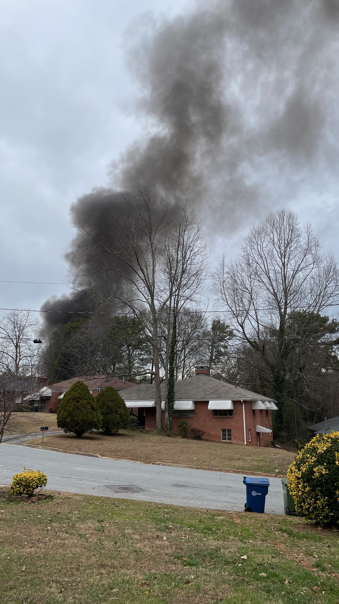
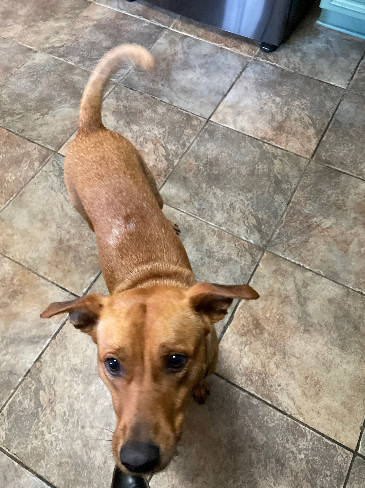

## January 7, 2024
 
New years is a made up holiday to increase commerce throughout the winter time after Christmas. Without convincing everybody to make resolutions for the “new year” no one would leave their house and spend money at businesses because it is cold and miserable outside.
  

----

 
Nuts are a good food but if you eat too many of them your stomach starts to hurt. I learn this again every morning because there is a large bag of almonds on my desk which I snack on as I work in the morning until my stomach starts to hurt.
  

----

 
Ilana and I went to stone mountain and I paid for a yearly parking pass but when I got to the parking lot and tried to put the pass on my windshield I realized the attendant did not give me the pass. So on our way out I told another attendant about this and she said they have to go through their security footage and confirm that I did not receive a parking pass and I would have to wait at least 10 days to receive my pass. The pass is $40 for the year. This lady was just following the rules and she did her best to help me out but the processes at businesses can be so ridiculously stupid. Stone Mountain Park is a really old business that probably has not changed any part of how it works for 50 years aside from accepting credit cards.
  

----

 
Yesterday there was a house fire at the street over. There was a thick cloud of black smoke and the fire department came and we saw the fire get extinguished when the smoke turned a lighter color and spread throughout the neighborhood.
  

*smoke*
  

----

 
I’ve traded KAT and Lauri Markannen for SGA in the fantasy basketball league.
  

*mfw i see the trade got accepted*
  

----

 
Does anyone know anything about or anyone who is a sales engineer or solution architect? Please reach out to me. I’m learning about these career paths and becoming interested in the idea as a way to learn sales skills.
  

----

 
I think I finally figured out how to power my LED screens for my project and the solution is way simpler than I was previously thinking. I’ve ordered a bunch of cables and I’m just going to get a bigger power supply and daisy chain the power cables. I haven’t tried it yet because parts are in the mail but I’m pretty sure this will work then I’ll finally be able to start working on making the software work well and hanging it up on the wall. I’ll probably eventually need to get a 3D printer to make a plastic casing for it.
  

----

 
The dog had a playdate with another dog and they were so happy playing together. I am starting to think we should get another dog so the two can entertain each other during the day.
  

*dog*
  

---- 

 
Next up in my Joe Rogan brainwashing journey is the cold plunge. I got one for Christmas and I am going to set it up next to the sauna.
