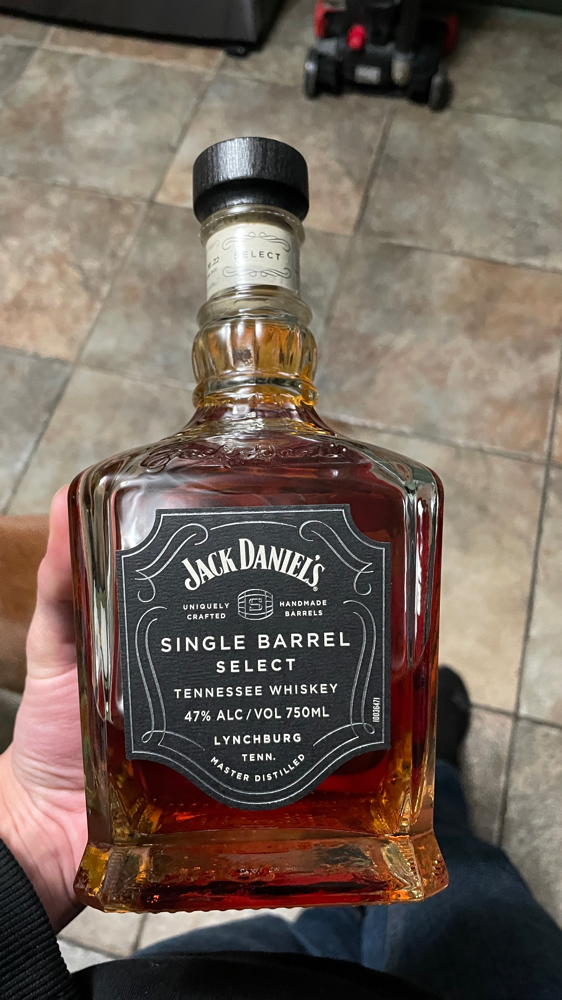

## January 18, 2024
 
I closed on my refinance for the house yesterday. I bought the house with a 6.5% interest rate and now I have a 3.99% interest rate which is really really great and is going to save me a lot of money in the long run. Shouts out to Shaqiul who let me know about this deal, [check him out](https://chowdhurys.georgiamls.com/) if you need a real estate agent, he’s fantastic.
  

----

 
Killer Mike performed at the Hawks halftime show on MLK day but when he was rapping they had to cut the mic on every other word.
  

----

 
Not talking about the Hawks btw.
  

----

 
The sauna tent in the backyard has been amazing. I’m not sure why more people with backyards don’t set this up. For a home addition it’s relatively cheap at about $1k. Great for health and relaxation and it gets me outside.
  

----

 
I’m using this new browser called [Arc](https://arc.net). There are a lot of weird internet browsers that try to be “better” alternatives to Chrome but most of them are just crappy versions of Chrome with less features to protect privacy. But most people including me don’t really care that much about internet privacy. Anyways this browser actually is really unique and has been pretty fun to use. I’d recommend giving it a try.
  

----

 
I spent some time this weekend moving this blog from my cloud server to my Raspberry Pi server in my office. I have a few more web services on my cloud servers but this is the most trafficked one so this was the biggest hurdle towards moving all of my web services off of the cloud and into my office so I don’t have to keep paying $25 per month on a cloud server. I did have to setup an S3 bucket which I probably will keep at $5 per month just to have a file backup in case something were to happen to the server in my office.
  

----

 
Ilana and I went to Austin and Anna Marie’s house for a high-class bourbon tasting. Since graduating college Austin I guess decided to learn everything there is to know about liquor. I guess when he graduated college he also graduated from Evan Williams to Woodford Reserve. Anyways it was pretty interesting tasting all of the different liquors and it got me inspired so I got a fancy bottle of Jack Daniels.
  

*fancy*
  

----

 
Speaking of new apps I’m using I also started using [Copilot](https://copilot.money/link/3f9vcXhQPNbYg6489) to track my money. Mint is going away so I needed to find a new solution and this one seems to work pretty well. Referral Code: `D9FBYH`.
  

----

 
It is winter time and the temperature is very cold this week. I always say I really hate the cold and I never want it to be cold and I never would want to live anywhere north of Asheville. But I guess Joe Rogan has taught me a thing or two about the cold and now I am starting to see how the cold can be invigorating. The dog seems to enjoy running around in the cold as well. Next up on my books to read is `The Wim Hof Method` by this man who lives in the arctic somewhere and gets cold all the time.
  

----

 
I said I wouldn’t talk about the Hawks but we did get a good win last night, DJ hit a clutch shot at the last second to win it. I hope we don’t trade DJ, basically everybody else I’d be ok with trading. Controversially I’d even be OK with us trading Trae if we get a good enough package back.