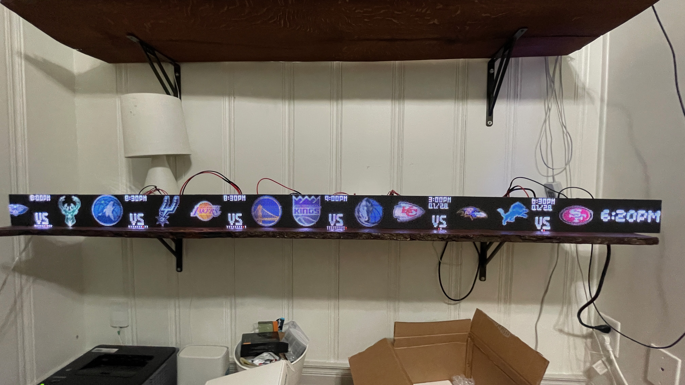

## January 31, 2024
 
It’s been just over a year since the first edition of the Evan Newsletter was sent out. Wow what a year it has been. We started out sending these out in the mail, then I set up a little web platform to put the letters on a website, then I switched it over to a hosted newsletter platform, then I started self-hosting that. I have gotten some feedback lately that some people prefer getting these in the mail. Part of the original idea for this was that it is nice to receive physical mail, so I want to start doing that again. However I do want to automate things, so I found a service ([postgrid.com](https://postgrid.com)) I can use to automatically send physical letters in the mail when I publish a new post. So if you would like to receive these in the mail please fill out this form: [https://forms.gle/qcG3BLan4UkabaME7](https://forms.gle/qcG3BLan4UkabaME7).
  

----

 
I finally wired up this screen and got it working. This is just over 6 feet long and I plan on making another variant that is 8 feet long. There is still some software work to do to polish it up but I’m gonna go ahead and take good pictures of this and put it on a website to start selling.
  

*sports*
  

----

 
The Lakers lost to the Hawks yesterday. Lebron was pissed. Everyone in the stadium was a Lakers fan and they were quiet the whole game because we won by like 20 points. We’ve got the Suns and Warriors coming up this weekend so those will be crowded as well since KD and Devin Booker and Steph Curry will be playing.

  

----

 
Lady the dog is doing well.
  

*lady the dog*