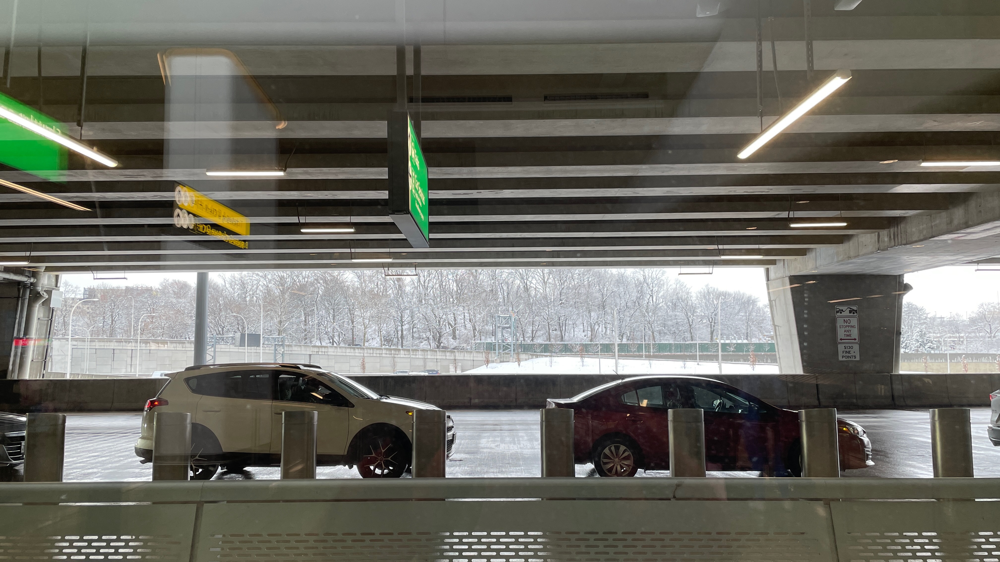

## February 23, 2024
 
Google has a ChatGPT type of thing called [Gemini](https://gemini.google.com) and it actually seems really good.
  
I returned the Vision Pro. One day I’ll be back for it…. one day….
  
Square stock went up a lot today because Jack Dorsey is laying off a bunch of people and trying his best to cut out all the bullshit that was happening. Time to sell.
  
I got a 3D printer and it feels like it is from the future. If anyone wants any sort of plastic thingamajiig let me know.
  

----

 
I am reading Poor Charlie's Almanack (cool interactive and free reading [online](https://www.stripe.press/poor-charlies-almanack)) in which Charlie Munger is an old man and rambles a lot about the same four or five things over and over. But it’s been a good read overall, he models himself off of Ben Franklin so reading the Ben Franklin autobiography first provided a lot of context. Munger rambles a lot about how important it is to learn and act from many different spheres of knowledge (psychology, physics, mathematics, philosophy, etc…). I’ve always felt this is right and am lucky that I got at least a decently well-rounded education in high school and college. And I am even more lucky that I’ve been able to have the time and desire to read books since then on varying subjects as I get interested.
  

----

 
[The Ticker Screen](https://thetickerscreen.com) progress is stalling as I finish out my last few weeks at the job. But once the job is done with I will be going full speed. I think I can get costs down to $100 per unit and sell it for $300. That would make this by far the cheapest option on the market and the highest quality. I’m not obsessed with being the cheapest option but personally I wouldn’t spend $600 on this product. But I would do $300. And there are definitely people out there who would spend $600 on this but I am willing to be there are a lot more who would spend $300 on it.
  

----

 
I’ve been sending voice messages instead of texts. Reactions are mixed. I like it and will continue.
  

----

 
I’m moving all of my web services off of DigitalOcean and onto Vercel. Vercel is too good of a deal right now at $20/month for as many web services as I want with autoscaling and autodeploy already configured for me.
  

----

 
Went to Atlantic City this weekend with the boyz and we had a great time hanging out but we lost money gambling and I’m never going back to New Jersey.
  

*snow at laguardia*
  

----

 
Ilana cut my hair and gave me a European soccer player type of haircut. It’s fun. She did a great job. I’m not paying for haircuts anymore.