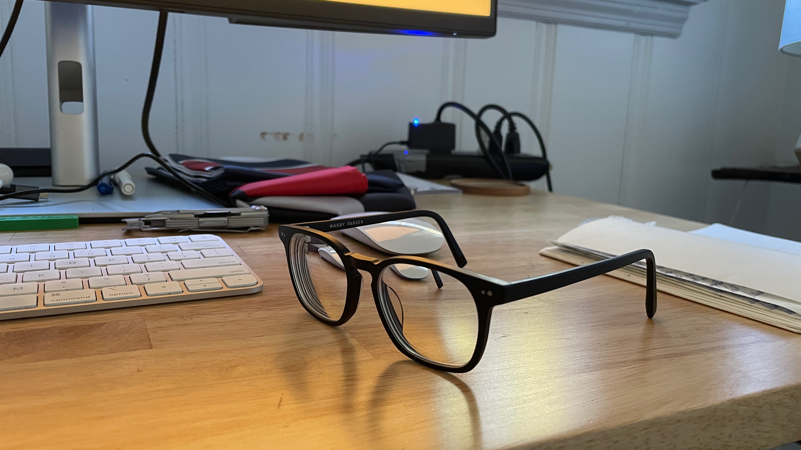

## March 19, 2024
 
These ticker screens are selling. I’m using paid ads and am under my target customer acquisition cost. While in preorder with nothing shipped out yet. I think I’ve found a good product and price point to where these things are going to sell themselves. Now I’m focused on finalizing the actual product and shipping it out in May for my preorders.
  

----

 
I’ve stopped wearing my contacts. I have always suspected that contacts are probably bad for you in some way but I did not have any idea how. Then I saw a random post on twitter saying that they are bad for long-term eye health because they block oxygen from the cornea. I saw that, did no further research, said “yep that’s probably right,” and have been only wearing glasses since. Then I realized my glasses had transition lenses which get darker outside and become normal inside, but they take a while to get back to normal which was very annoying so I got a new pair of glasses.
  

*spectacles*
  

----

 
My garage looks great after the update. I cleaned out all of the crap that was in there from the home’s previous owner, hung up color-changing led lights all around the ceiling and railing, moved the squat rack and bike, and elevated the TV and put the playstation in there. I also put blackout curtains over the windows and put a flag up. I have some sports team flags in the mail that I am going to hang up around the rest of the garage when they get here.
  

*hgtv remodel joe rogan edition*
  

----

 
I’ve been listening to a podcast about ecommerce and the whole subject is very interesting on its own but also very pertinent to me now. Hopefully the company will grow one day to where I will need to hire people but for now I am having fun doing everything myself and learning about every aspect of what makes a business run and run well. Lots more learning left. Anyways, I listened to an episode where they interviewed a guy running a business that sells beef jerky. I wonder if it is feasible and beneficial to get most or all food from Direct-to-Consumer food brands from their website. I think you could get everything you need except for maybe fruits and vegetables. And it might end up being cheaper and healthier. Cheaper because they don’t charge as much due to not having a wholesale fee (they still have to pay for online ads so not sure at large scale if this cost typically ends up being smaller or larger than the wholesale fee) and healthier because it seems to be that most D2C food brands are trying to solve the problem of not enough healthy things in the grocery store.
  

----

 
Lady got a little cut on her paw and I walked around the yard and found a big piece of glass so I’m guessing that’s how she got cut. She has had to heal so we got her these little booties so wear outside so she doesn’t get dirt in her cut. One came off of her and we couldn’t find it for 3 days. Then suddenly it’s on the back deck because I guess she grabbed it brought it back to us.
  

*injured dog*
