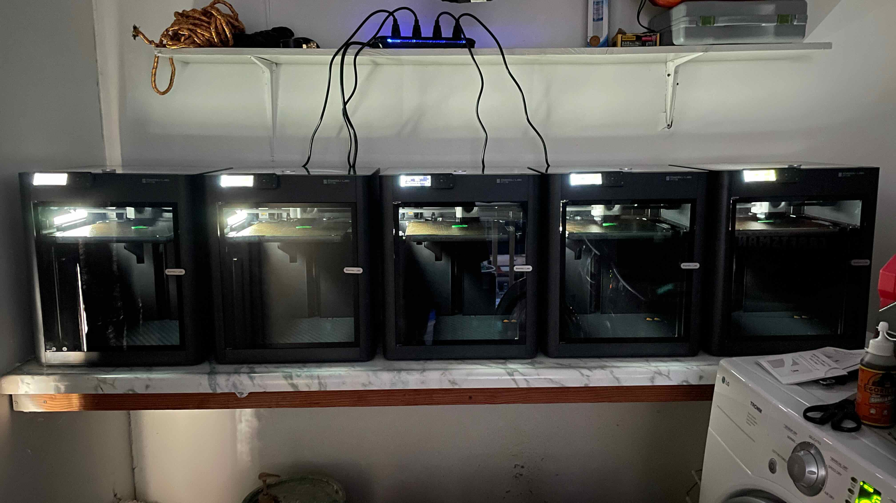

##April 22, 2024
 
Click [here](https://evanverma.com/posts/04-22-2024) to view this email in your web browser.
  

----

 
May 13 is when I am going to ship out orders so I have about 3 weeks to get everything ready. Parts from China are in the mail and should get here this week. The 3D print farm is all set up and humming along in the laundry room. I built a production model and I’m making some software tweaks but all-in-all things are looking good. Putting a single unit together takes a long time so I’m starting to wonder how I can get the assembly done in another country or hire some people to help out with it here. I strongly prefer doing the latter, but the cost could be outrageous because I would need to rent some sort of warehouse space. Anyways, not an immediate issue just some wonderings.
  

  
*printers*
  

----

 
I’m going to delete the fantasy baseball app from my phone. I have been spending too much time fiddling with that. Why am I spending so much time on this? I can’t help myself. My lineup is secured anyways so I don’t need to touch it anymore.
  

----

 
We went to a charity event for Maya’s eye condition and Freddy Falcon was there. Ever since I have heard about the mascot life from undisclosed friend who was a mascot I have much more empathy for the secret lives of the person inside the suit. Freddy Falcon was not just a mute soulless friendly bird person, but a real guy just doing his job. There was also a dead deer on the side of the road at this event and I got very close to it.
  

----

 
Social media ads are really really good. I put bare minimum effort into my ads and I have been amazed that they really work. I guess I always knew that social media ads worked well but I wasn’t sure if they only worked for larger businesses who throw mountains of cash into it. I only have Meta ads running right now and they are doing great. I’m sure it has something to do with having a good product and landing page, but it’s really crazy that I can plug an ad into their engine, pay a small amount per day, and get lots of qualified traffic to my website. With a small amount of cash you could set up a lot of landing pages for various business ideas, run ads for all of them, and figure out what works without spending very much money or time.
  

----

 
Since I won the fantasy basketball league I get to bet $100 on the NBA Finals winner. I’m thinking OKC but Ilana is watching all of the Round 1 games to help me make an informed decision. Ilana and her friends are going to a casino in May before Round 2 starts so she’ll do the bet for me then.
  

----

 
I wear shoes in the house now during the workday because when it helps me feel like I am really working.
  

----

 
The response last week to our call to action was overwhelming, many many many people replied with their favorite flavor of tea. Unfortunately the tech was not configured right so replies did not go out. That has been fixed now.
  

----

 
Call to action! Reply to this email with your favorite springtime activity.