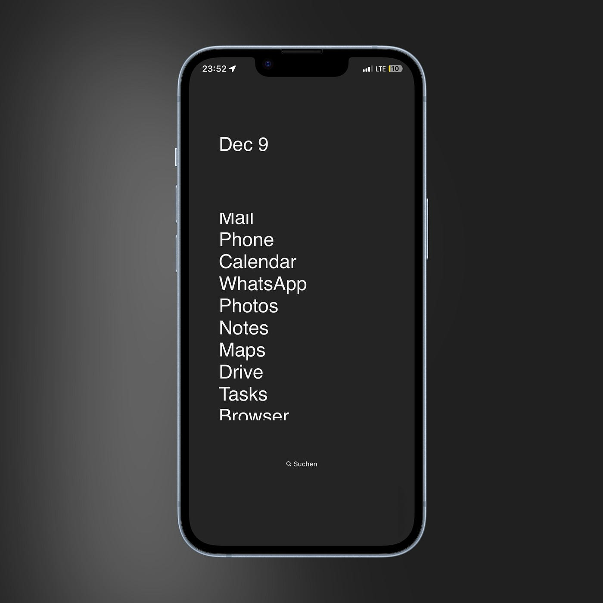

## May 30, 2024
 
Click [here](https://evanverma.com/posts/05-30-2024) to view this email in your web browser.
  

----

 
Well it’s been a long time since a newsletter has come out. When I switched over to doing a custom solution for this I said I better do this now before I get slammed with work because after that happens I won’t have any time to do any work on this. Well my custom solution broke because my email provider decided to randomly stop working and I checked it again today and it looks like the email provider decided to randmoly start working so now I can send out newsletters again. I have time today because work is at a standstill. I keep having massive success and fucking up massively. It’s a sequence of highs and lows that is exactly what I expected but it makes me want to throw up sometimes.
  
My most recent fuck up involves running out of supplies from China, so I had to order these supplies and am basically waiting on those to get here now. Lots of people are waiting on their orders and I have told them what date they will be shipping out. I already delayed that date by a week and now it will be delayed at least another week. At the end of the day they will all get their orders and be fine but they will also get mad at me and that is no fun to deal with.
  
On the other hand I’ve shipped off 13 out of 30 orders and things are going fine for the most part for them. Three of them were not packed well so two of those were damaged when they arrived so I have to send them new units. Other than that as far as I know everyone is a happy customer. Like I said, highs and lows.
  
I’m going to have to hire people pretty soon. Building these units takes me a long time and I don’t have much time for anything else because I have so many orders to ship out quickly. Now that I ran out of supplies I don’t have much going on, but once the supplies get here I will be working like crazy to get the units out to people which will already be late. I’ll need to hire people to build these units for me after this round because I need to spend time on marketing, software development, customer support, etc. I also might hire a virtual assistant from the Phillipines for cheapish to help out with that stuff. Eventually hiring a software developer from Latin America would be great also but I have to carefully balance spending with how much money I have coming in, which right now is zero.
  
I’m pretty racked with stress but all in all my problems are not a big deal. Everything is gonna end up fine. I have plenty of savings to live off of still and the problems I have are nothing that will kill the business.
  

----

 
I got this iPhone app that changes my home screen to look very bland and boring and it actually is working to get me to spend less time on my phone. Also deleting all of the social media apps helped. But it’s a cool app. The only entertainment thing I keep on my phone now is the Kindle app so I can read. I started reading on Kindle now instead of physical books so that it can sync with my phone and I can read wherever I am. I lost the Kindle I had and was looking for it for weeks but never found it so I bought a new one. The new one is way better anyways so I’m glad I got it. I used to like reading physical books more than Kindle but this new Kindle version is really good so I think I am liking it more. I read “The Sun Also Rises” for probably the 3rd time. I’m still not sure exactly what it’s supposed to be about but it’s very fun. Ernest and all of his friends are alcoholics and live in Paris and party in Spain and watch bullfights and drink and eat at cafes.
  

*boring*
  

----

 
We took care of Ilana’s parents’ dog Cookie and it peed and pooped in our house multiple times for day. It is a very bad dog.
  

----

 
Today I’m just enjoying myself. The weather is nice and I will save stress for tomorrow. Maybe Ilana and I will go to the Braves game tonight. I’ll play with the dog and clean up things in the house and not worry about much. Time moves along and eventually all of these orders will be cleared up one way or another so today I might as well enjoy myself.