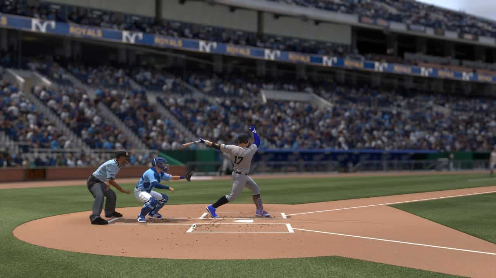

## July 13, 2024
 
I have some compliance testing coming up that really is going to make or break things for the company and I have no idea how it is going to go. If it fails and there is nothing I can do to fix it then I’ll make a bunch of software products as fast as I can and try to sell those and if that fails then I will very quickly get a job because my bank account is quite a bit smaller than it was when I started this. YOLO no ragrets.
  

----

 
I have had trouble with my grill recently and I found out it is because the bottom gets clogged up with ash so I bought a little basket which is supposed to keep the bottom clear. Now I will make a brisket and invite the loyal readers of the Evan’s Weekly Newsletter over to my house for a big brisket party to thank them for their loyal readership.
  

----

 
My parents were very nice and got me the new baseball video game for my birthday and I think it is very fun but Ilana said it is not very fun but it is addicting. I agree with that as well. I play online and I wish there was voice chat like in COD but I guess the game is rated E so they can’t do that.
  

*hitting dingers in cyberspace*
  

----

 
Millan’s blog partner Mano is now the editor-in-chief of pitchfork and it’s [big big news](https://www.billboard.com/pro/pitchfork-names-mano-sundaresan-head-editorial-content-exclusive/). Mano is one of The Dope Boyz’ biggest fans so he agreed to put us on the front cover of pitchfork every single day.
  

----

 
Well everyone seems to be talking about politics recently. I for one am a one-issue voter so will be voting for Joe Biden because he supports trans rights.
  

----

 
[Shipping container homes](https://bobscontainers.com/). Think about it. Big business here. Who wants to go in?
  

----

 
Many people are getting engaged around now or looking to do so soon. Well I guess the weather heats up and everybody gets all hot and horny and they just have to engage themselves with each other. Well congratulations to you all (sincerely).
  

----

 
One lesson I’ve learned from fantasy baseball…. if you want to win, you have to work harder than everyone else. I’ve been on the grind day and night and the results are showing. We still have some competition but the grindset won’t stop.
  

----

 
Reader interaction time! Reply to this email with your favorite summertime activity. We tried this before and I messed up the tech so it didn’t work, but it will work now I promise.