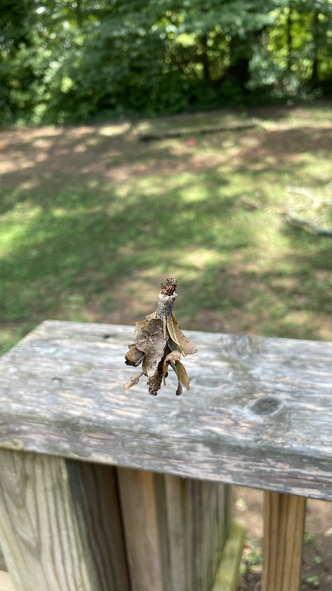

## July 24, 2024
<br>
I just had a call with a startup company that has an AI product for the legal industry. They want to give me a contract job to do sales for them. No salary, it’s commission-only. I figure this could be a good move right now because
<br><br>
1) Their team works day jobs and it’s commission only so I can do flexible hours.
2) The FCC testing went very badly. Very very badly.
<br><br>
I’m not quite out of money but things are trending in that direction. Working with this startup company could help me learn sales skills and help me not run out of money. Meanwhile I am entertaining quotes for designing a new PCB and adding cable shielding all over the device. The costs for PCB design + manufacturing are probably gonna be high, plus I have to pay for more sessions with the FCC testing company which is a high price.
<br><br>
But as always I’m pretty optimistic. I don’t see any insurmountable challenges. If anything, having hurdles like this encourages me since these sorts of issues act as a moat against competiton…. the tougher the problem the fewer people who are willing to solve it.
<br><br>
Of course, this isn’t really such a tough problem for those with electrical engineering expertise, that’s just not me. Part of the reason I decided to build and sell this was because I made a vague guess that very few people have the skills to build the software, build the hardware, and sell it effectively, so I could make a quality product at a much lower price than the few competitors out there. Of course, I don’t really have the skills to build the hardware properly so now I’m forced to tackle that problem.
<br><br>
Luckily I had a lot of help at the testing facility and made a new friend there. He’s been pointing me in the right direction and has been invaluable teaching me about fundamentals of electrical signals in consumer devices. Reece also offered to take me to a lab at Georgia Tech where I can do some precompliance testing and save a bit of money which is very much appreciated.
<br><br>
Last thing, I’m also beefing up organic marketing. Orders are going to open up later than expected due to this issue so I figured while things are getting worked out there I can open up the website to collect emails and try to do some SEO and social media stuff. I put some AI-generated blog posts up on [the website](https://thetickerscreen.com/blog) to hopefully hit some keywords. But what would really help there is quality content about sports. If anyone wants to write something about sports that will get seen by lots and lots of people (becuase I’ll blast it out everywhere I can), it would be very very much appreciated.
<br><br>
Ok that’s all the business news.
<br><br>

----

<br>
There’s a big event tonight that I have been given the great honor of being asked to be a part of. I’ll wait to send this out until afterwards so I can add pictures from it.

Well it’s later now and I was supposed to be the photographer for Joey proposing to Yuval but things got confused and it didn’t work out. But their proposal worked out great apparently, I didn’t see it, but anyways many congrats to the engaged couple!
<br><br>

----

<br>
The internet is so distracting. When I have something that needs to get done I always get it done but when I don’t have a clear problem to solve or task to do I’m always just scrolling twitter or fantasy baseball or whatever else when I really should be silently sitting and prioritizing things to do.
<br><br>

----

<br>
Yesterday this object was floating in midair above the back porch. Upon closer examination I discovered that a small insect was living inside the structure and was suspended by a small thread hanging off of a very high tree branch. I decided that this was a caterpillar in a cocoon who encountered some dangerous circumstance in the tree branch, forcing it to descend from its previous habitation. Unfortunately, its new chosen habitation was home to a rabblerousing canine. The caterpillar eventually descended onto the railing of the deck, then the next time I checked on it it was not there. So either it turned into a butterfly and flew away, or Lady the dog got a hold of it. Either way, its safe to say this caterpillar had a transformative experience.
<br><br>

*strange nature object*
<br><br>

----

<br>
I used Chat GPT yesterday to convert some text into html. After about a month with a subscription it’s been super useful and not a gimmick at all. Very surprising. Apparently [claude.ai](https://claude.ai) is even better.
<br><br>

----

<br>
Last week we included reader participation and the response was overwhelming. There were more responses than one could possibly count. The numerous readers of Evan’s Weekly Newsletter responded in droves with all of their favorite summertime activities. Devon came in with the _Editor's Choice Response of the Week_. Check it out:
<br><br>
```
I like to hang out with friends 
and certainly don’t mind "sippin" 
on an ice cold beer. Who’s with me??
```
<br>
I’m with you Devon.
<br><br>
Due to the massive response and demand for participation in Evan’s Weekly Newsletter, we will be continuing our reader participation section. This week…
<br><br>
Do you play fortnite? If so, what is your favorite fortnite character? Any particular strategies which you employ? Maybe you play a different video game? Or read a book? Just sit in silence and think? Describe your experience.