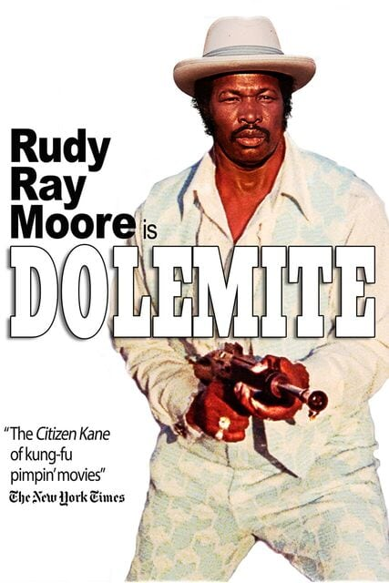

##August 7, 2023
 
Huntsville, Alabama is my newest fascination. NASA and the FBI have a huge presence there, which means lots of government contractors are based there. There are lots of STEM jobs and population is apparently growing like crazy. They have a minor league baseball team called the Rocket City Trash Pandas. The downtown is apparently walkable and nice, with shops and restaurants and such. Ilana will be looking for a coding job one day, and it might be that she has to find an in-office job since she will be just starting out. Atlanta will have plenty of these opportunities for her, but Huntsville may be a good backup option. And if we are moving there anyways, it may be a good place to buy a second home and live there before moving back to Atlanta and renting it out.
  

*trash pandas*
  

----

 
I played tennis yesterday and in the middle of the final point it started pouring down rain. Joey and I are betting on our games now and I lost eleven dollars. The heat is ridiculous.
  

----

 
I think, given my skills, the simplest type of business I can make with the largest chance of success is a regular software consulting business. I could either do the work or hire software developers in India to do the work with a margin on top for myself. Since I want to just start selling something and getting some business somehow someway.... this seems like a good, simple idea to start with. Ilana and I watched the newish Eddie Murphy "Dolemite Is My Name" yesterday. It was a nice movie and was a good reminder that hustling and never quitting is the sure path to success.
  

  

----

 
Oppenheimer was long. Right after the movie ended I said I would never watch it again. But now I kinda want to watch it again. It was exactly the same as the book was. Just about everything in the book was exactly in the movie or was referenced to in the movie. But watching the movie helped me feel what these people might have felt while they were building the bomb, fighting politics, etc.
  

----

 
It feels like the storms are worse at my new place. Maybe because I am closer to downtown with the tall buildings that attract lightning. We are hearing some big booms. Also many nights we are probably hearing gunshots.