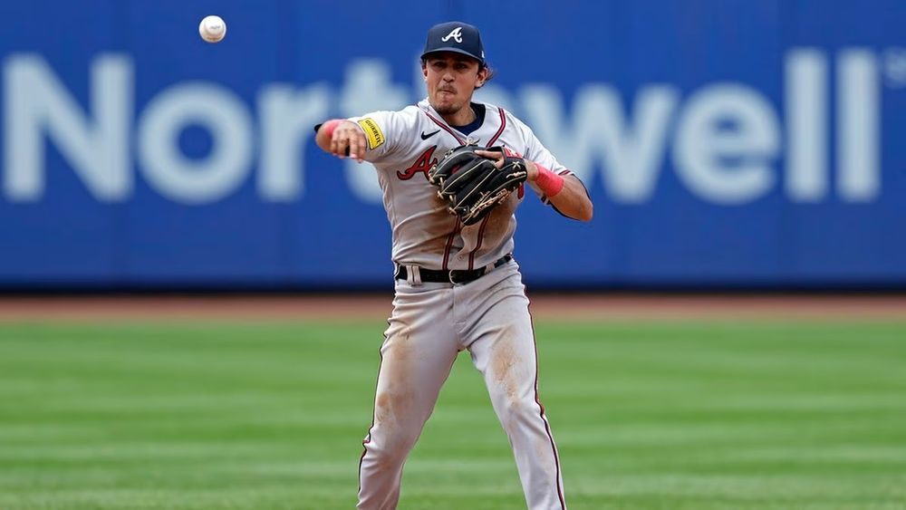
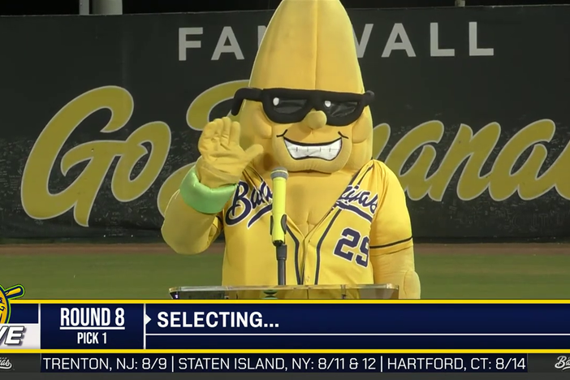

## August 14, 2023
 
Work has been super busy. It feels good to have a lot to do and to feel like I am an important part of the company. For a long time at this job I felt like I had no idea what I was doing and provided no value. On the other hand, I always appreciate more time to work on side projects and business ideas. It is quite a blessing that I enjoy programming and working enough to make time for both my job and my side projects. But time management is always a challenge. This past week I have started scheduling my time on my calendar app so that I have a clear idea of how I want to use my time. It's been fairly simple so far — 9-5 work, 5-6 exercise, 6-7 work on side project. One year when I was in college I was overwhelmed with activities so I signed up for some "study strategies" help from a counselor. He showed me to schedule every single activity of every day on my calendar (including rest time) so that I can maximize my time. Surprisingly, that really really helped me in college, and so far this week this schedule has worked similarly well for me. The great thing is now I am not nearly as busy as I was then.
  

----

 
It's been a nice weekend just laying around the house and watching baseball. The Braves played 4 games and won the first 3. The best game was Saturday afternoon where they beat the Mets 21-3. The Mets had their second baseman pitching in the 9th and the Braves followed up by putting their Shortstop on the mound. What's great about baseball is as soon as the baseball season end, the basketball season starts. And as soon as the basketball season ends, baseball starts. Football always has a way too long off-period and the season overlaps with basketball and baseball. A lot of my brain power lately has been filled up with sports but that's kind of always been the case. I think growing up watching sports and keeping at it is part of the reason why I hustle and work hard — I'm focused on winning.
  

*nicky lopez*
  

----

 
The time I am allocating every day towards working on a side project so far has been spent by reading a book on Sales. I am aiming to read a lot of these books (get my education, so to speak), then I will go out there and start talking to people and selling whatever it is I have or will build. But the book, distilled, is basically saying that Sales is just a game of who can call the most people. You have to talk with as many prospects as you can and eventually some will bite. I think this is going to be very doable, and even possibly fun
  

----

 
It looks like my family is going to Savannah for half a week before Thanksgiving. I'm excited for that. There's tons of history in Savannah, the weather will be nice in November, and it's not too far from Atlanta. Yesterday we turned on ESPN and the Savannah Bananas were playing on ESPN. Apparently tickets to their games are over $200. What an institution.
  

*banana*