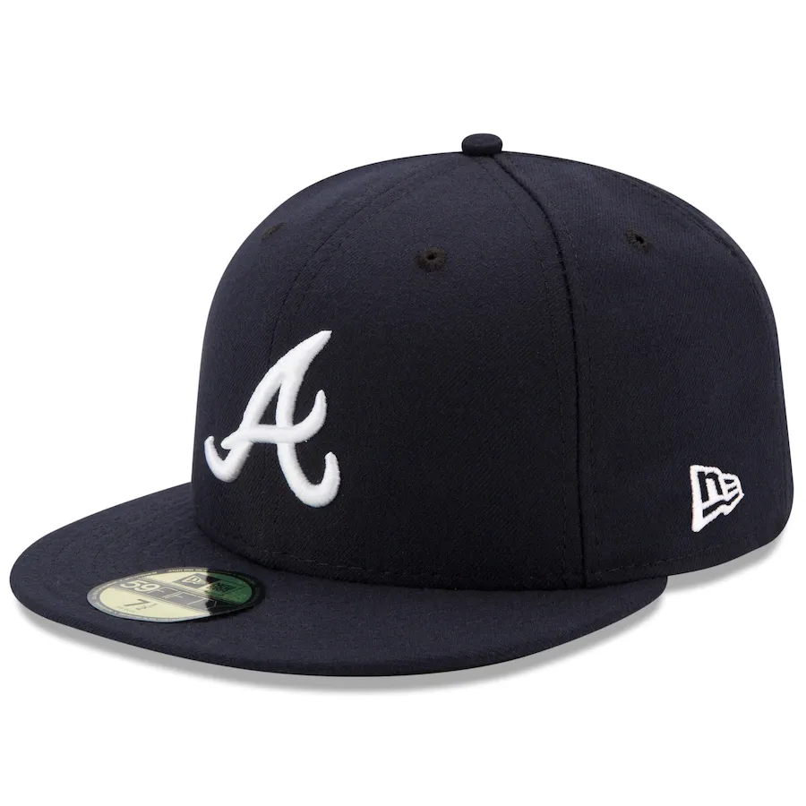

## August 24, 2023
 
My car is busted because when we were moving out of the apartment I parked at Fellini's for to grab a pizza to-go and someone broke the window and grabbed Ilana's record player. The car was packed with stuff, I'm glad that's all that happened. But the car has had a busted window for almost a month now because the window repair people my insurance pays for have been taking forever. Anyways, I walked to the grocery store on the Beltline the other day since we had been spending a ton of money on grocery delivery. There's a trendy organic grocery store 3/4 mile from the house. It was very nice and with very reasonable prices. The walk was not bad at all and the store had pretty much everything we needed. Good prices on meats and veggies. I am enjoying the location I live at more and more every day. Being on the Beltline and being able to walk places like that makes it not so bad when I can't use my car for a bit.
  

----

 
It's been really hot outside. But it feels so nice after you go on a long walk and you come inside and you got sun on you and you are sweating then you shower and go to sleep and you sleep very well.
  

----

 
I have a stack of ten books about Sales that I am hoping to finish in the next few months. I think that if you want to learn about anything you can buy ten books on the subject and then you have learned about it. I've read one so far and I'm working on the second. These are nice, easy to read, and interesting books, so it hasn't been much of a problem. Reading ten books about physics would be much more difficult.
  

----

 
My Aunt C ordered us some rocking chairs for the front porch. It was extremely nice of her. I am very excited for the rocking chairs to come in because the front porch is pretty large but it has not had any furniture on it. The only thing that has been on the front porch is a large rug that Ilana's parents gave us but once we brought it to the house we realized it smelled like cat piss so we left it outside on the porch. So today I need to set up the rocking chairs and dispose of the cat piss rug.
  

----

 
I got a new hat. It looks like this. I have been wearing it during the day. I just thought you should know so that if you haven't seen me in a while you can have a good idea of how I am dressing recently.
  

*hat*
  

----

 
It's been a long time since I've done some rapping. The last time The Dope Boyz got together we made a top 10 album of all time. Hopefully we will get together sometime this year and go for top 5.
  
How many children does the rapper Future have? Twenty? If I was Future's child I would probably brag about it and listen to his music and all of my friends would think I am so cool because Future is my dad. But deep down inside I would be sad because my dad is too busy with his hoes and doesn't spend time with me.