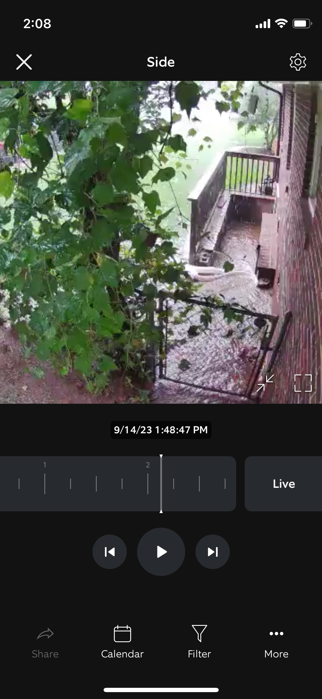
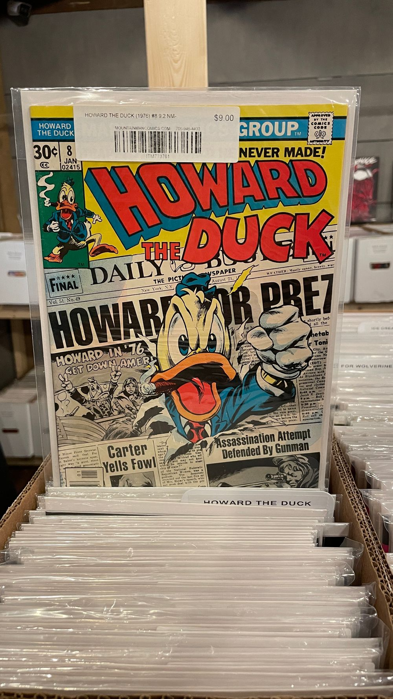
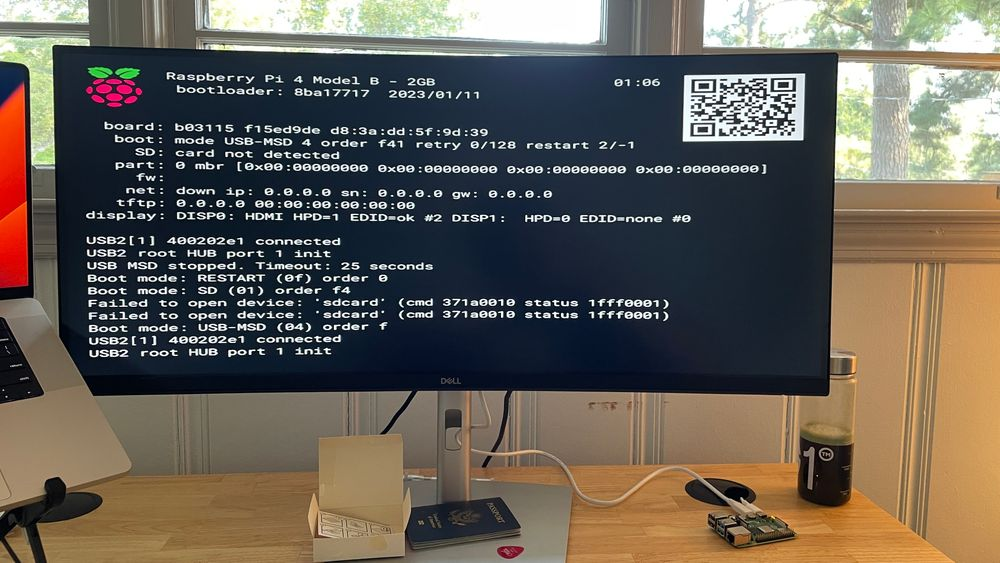
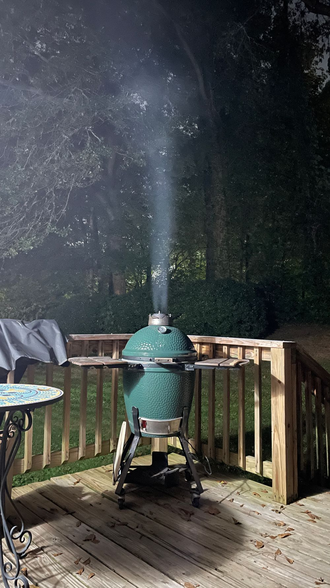
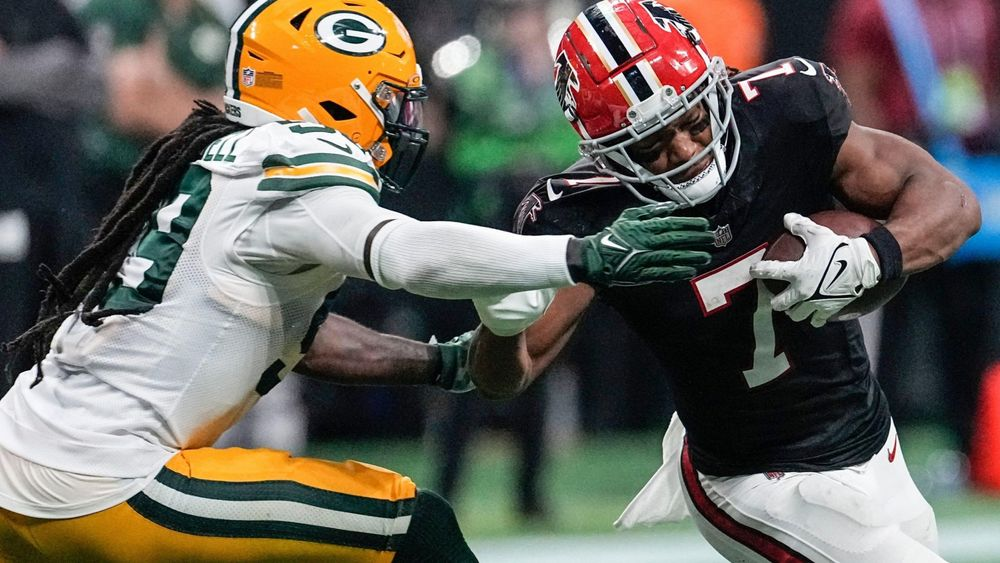

## September 18, 2023
 
The west side of Atlanta got 3 hours of rain in 15 minutes and my crawl space flooded. The force of the water ripped the door off its frame. A guy came out with a hose and sucked up the water and now I need to replace my water heater and the door and landscape the yard so water doesn't flow down there anymore.
  

*water*
  

----

 
Ilana and I went to Blue Ridge this weekend and we went to a comic book store in downtown and I found a Howard the Duck comic. Millan and Benjamin and Luke and I watched the movie a bunch when we were younger and it was on Netflix.
  

*duck comic*
  

----

 
I am starting to play around with microcontrollers. I got a Raspberry Pi and an Arduino. There are still some parts in the mail but I am hoping to make a ticker screen like they have at sports stadiums so it can show sports scores and stock prices and whatever else I want. Then I could probably sell this because as far as I can tell there is only one company online that is selling these things and they are selling it at an outrageous price with an accompanying mobile app that looks pretty crappy.
  

*computer*
  

----

 
There is not a good place to run at the house in Blue Ridge so I decided that when I travel I need to bring my jump rope with me and use that for my cardio exercise. Jump Roping is pretty intense. Some people make the jump rope go around 2 times while they only jump once. Some do 3.
  

----

 
I was out back grilling and took a pretty picture of the grill.
  

*burgers*
  

----

 
I got a code to join bluesky and eventually I got an invite code to let someone else join so I gave it to Tommy since he had asked me a while ago for it. I just got another so if you care about that sort of thing let me know and I'll give you the code. I don't know why there has to be so many versions of twitter now. To the regular person I'm pretty sure they are all the same thing. It is kinda cool that bluesky only has a million users so it's pretty small. If you find someone famous on there and you chat to them there is a bigger chance they will reply than on twitter.
  

----

 
My sales book reading is going well. The book I am reading now is by a guy who did hostage negotiation for the FBI so the stories in it are pretty interesting. My pace is slow but steady, this is the 3rd book and I'm about halfway through.
  

----

 
The Falcons are looking good. I haven't gotten to watch too much but I watched some of the game yesterday against the Packers. Desmond Ridder looks at least passable and Bijan Robinson is incredible. From what I can tell the offensive line was getting beaten up, but to me our skill positions on offense and our secondary on defense looks pretty good. I'm watching NFL this year because all of the money and player transfers and conference reorganization in college football seems dumb to me. Also the Falcons' retro logo and uniforms look way better than the modern one, they should permanently switch.
  

*bijan*
