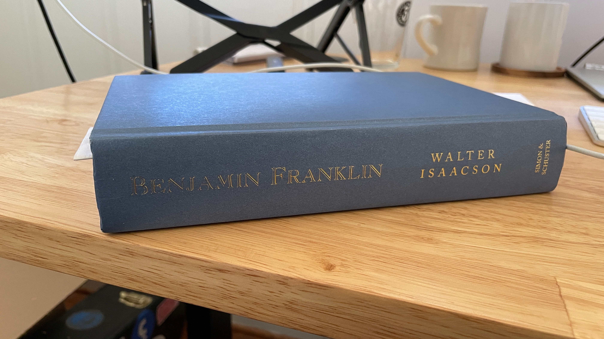
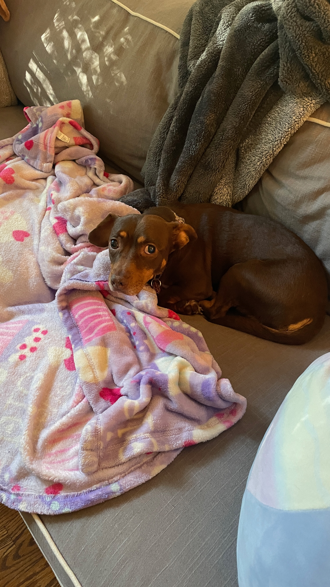
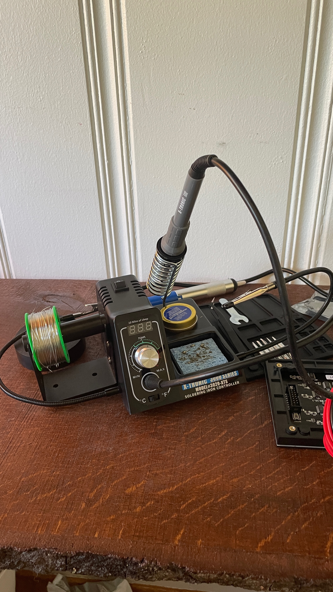

## October 3, 2023
 
Jump roping is destroying my legs. I have shin splints every day. The roping life is a hard life, but it's the life for me.
  

----

 
I'm getting excited for our fantasy basketball league. I did fantasy football growing up so this will be a fun new thing. And Ilana and I got those Hawks season tickets this year so it's gonna be a heavy basketball year. First game is a preseason game on October 10 so it's coming up real soon. I'll post recaps of the games on here.
  

----

 
Ilana is gone Oct 13-21 so if you are in Atlanta holla at me because I don't really have any plans. I might go camping for one or two days but that's pretty much it. I took off from work that week so otherwise I'll just stay in and work on side projects.
  

----

 
I'm reading the Benjamin Franklin biography because the Walter Isaacson author came out with the Elon Musk book and I actually want to read that but for some reason I decided to read his Benjamin Franklin book instead. My Daddima is a big Ben Franklin fan so its a good thing I will be learning about him. She likes Warren Buffett a lot too so maybe one of his books should be up next.
  

*book*
  

----

 
We are keeping Ilana's parents' dog at the house this week. It's name is Cookie and she is a small brown dog and she is afraid of the outside. I am going to have her sit next to me outside a lot this week so that she can overcome her fear.
  

*cookie*
  

----

 
We went to New Orleans this past weekend and it's pretty wild there. I don't know if that's quite the city for me. Lotta weirdos in New Orleans. And I'm more of a quiet type of person and it's quite loud in New Orleans with all of the music and the people walking around and talking and drinking alcohol. Well the reason we went was so that I could do my Global Entry appointment but I forgot to bring my passport.
  

----

 
Columbus Day is now apparently called Indigenous Peoples' Day and I have the day off. Who would have thought. We didn't even have school off for Columbus day growing up I don't think. But now that it is Indigenous Peoples' Day is it a much more important holiday. Lucky me.
  

----

 
I got a new soldering iron and it looks pretty intense. But it might work a little too well because I used it on my chip and now the chip doesn't work. So I ordered some more parts and I guess I am going to do less soldering or figure out how to do it without breaking things.
  

*gadget*