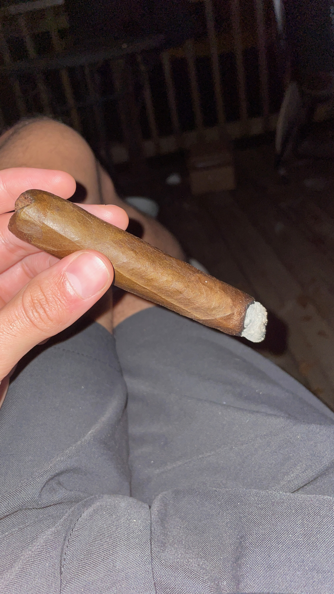
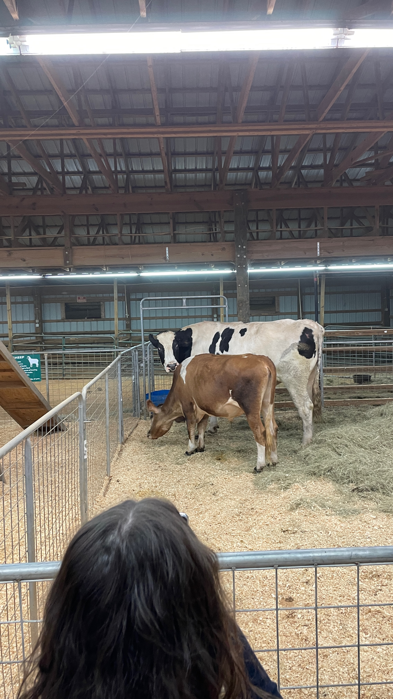

## October 9, 2023
 
I have today off of work, as noted in last week’s edition. I’ve been spending time this weekend moving the newsletter from [Ghost’s](https://ghost.org/) hosted platform to hosting it myself. Ghost charges $10/month per hosted blog. I’m paying $14/month for a cloud server to self-host now, but this cost stays the same as I add more blogs. I made a new site for logging my mornings and keeping me accountable to start off the day well at [evnv.day](https://evnv.day). I also changed the domain of this site to `evnv.news`. If you want to start a site let me know and I can set it up for you on my server. Also, I started paying for an app called [Ulysses](https://ulysses.app/) which lets me publish straight to any of my self-hosted sites. Including the app my total cost is about $17/month, which is cheaper than the $20/month I would be spending to host 2 sites with Ghost.
  

----

 
Moving into the new house was a long and slow process and in the midst of it I stopped keeping discipline with waking up early and exercising every day and doing chores. So as I said before, I made a new site to log my mornings to keep me on track with this stuff.
  

----

 
When Ilana and I went to New Orleans we bought a cigar from a shop but I left it at the hotel. I was bummed that I left it at the hotel and probably if I had not left it at the hotel we would have only smoked a very little bit of it at home but I was bummed so on Thursday I was out running errands and went to a cigar shop. It was like a bar/lounge type of place and it was full of men smoking cigars and drinking liquor. There was a small little shop with cigars inside and I went in there and grabbed a random cigar and bought it. I sat on the back porch for a while and smoked it. Ilana said I was out there for 2 hours. I got very sick afterwards and I wanted to throw up and I was dizzy and Ilana said my temperature was really cold. I said I won’t ever smoke a cigar again after that but that’s probably not true. I looked it up and apparently smoking cigars isn’t really too bad for you, especially if you don’t do it any more than once a week. I’m not gonna do once a week but I might do it occasionally now.
  

*cigar*
  

----

 
Cookie the dog had to go back home on Saturday. I am very sad that Cookie is gone. She was a fun dog. She got comfortable with the outside and she was running around the yard and exploring. But we did get a rug in the mail and laid it out and she pooped and peed on it.
  

----

 
Out fantasy basketball league is ruined because immediately after the draft Jake decided to trade Giannis for Chet Holmgren and Myles Turner. So now Tommy’s team is OP. But actually after I typed this I reviewed all of the rosters and I don’t think Tommy’s team is OP. It’s only a 4 team league so everyone’s team is stacked up with talent and Tommy had drafted a lot of riskier players like Wembanyama, Scoot and Jordan Poole. But actually just as I was typing this I realized this trade was still pending and I can veto it so I did and I saved the league. But Tommy had traded me Lauri Markkannen for KAT because he had too many PFs assuming the Giannis trade went through. Lots of action happening.
  

----

 
Ilana and I went to the fair this weekend. We saw the chainsaw man making a statue of a bear and a Native American dance show and a pig race and went to the petting zoo and saw animals.
  

*cows*
  

----

 
The first Hawks home game is tomorrow and Ilana and I are super excited. We’ll get to sit in our seats and see the players and get hot dogs. The fantasy basketball league makes me even more excited for the season because I have a lot of players to root for and against now. I’ve got DJM on my team since I needed a Hawks player to root for throughout the year.