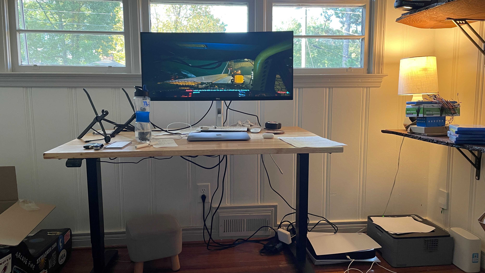
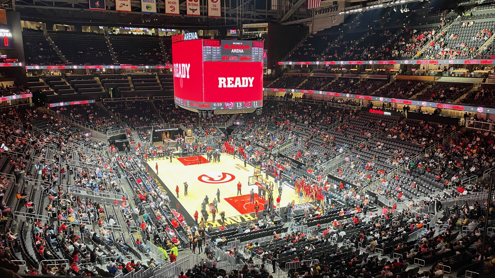
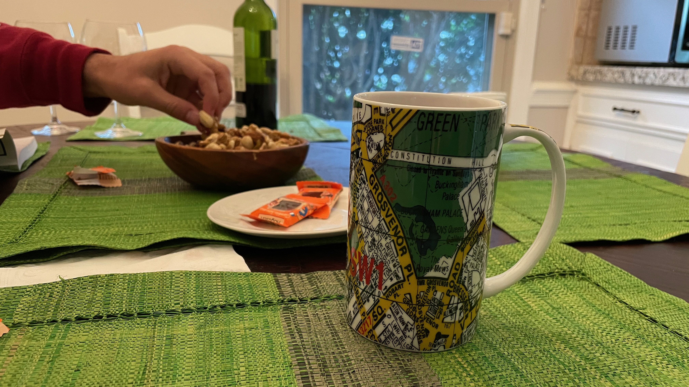

## October 24, 2023
 
Apple products are really great. Right now I am writing on my personal MacBook, which is sitting next to my work MacBook (with the apple keyboard and Magic Mouse), which is sitting next to my iPhone, while listening to music in my AirPods and wearing my Apple Watch. The total cost of all of these items is about 1k (personal laptop) + 2k (work laptop) + 50 (keyboard) + 50 (mouse) + 700 (iPhone) + 200 (AirPods) + 500 (watch) = $3500. Good lord that is a lot of money.
  

----

 
Speaking of what’s on my desk, I hooked up my video games to the monitor in my office so I’ve been getting a lot more video game time in. I started playing Cyberpunk and it’s pretty good, it’s like GTA but better.
  

*videogames*
  

----

 
I’m working on building a ticker screen to sell and I’ve set up the LED matrix and got it show images and text. It’s fun working on that stuff. The thing about trying to start a business is there is so many things that need to be done. So far I’ve set up an ecom website, registered an LLC, set up a business checking account & credit card. The next thing is I need to drive traffic to the website which means I have to do SEO stuff, which apparently is a lot of work and mainly involves writing blog posts to get “ranked” (show up on google) for obscure keywords people search. Then I need to figure out how to convert traffic into sales which will be a whole separate thing. And that’s all besides building the product itself which is a small effort on the hardware side but a fairly large effort on the software side. The amount of things to do can be overwhelming but it is all still very exciting.
  

----

 
If something bad happens to you it is most likely 80% your fault. When my car got broken into it was 80% my fault because I parked in Atlanta in a dark parking lot with the car full of crap and 2 bikes on the back. People don’t seem to agree with this. When I was learning to drive I learned to be a “defensive driver” which meant to watch out for other people doing dumb stuff around me, so that if someone did then I would be able to avoid it. If you don’t defensive drive through life then bad things are going to happen to you. In America guns are legal so everyone is able to defensive drive to the utmost, so that if someone attacks you and you are not prepared it is 80% your fault (disclaimer I don’t own a gun).
  

----

 
**Hawks vs Cavs Preseason Game**
 
The stadium was super empty. I parked in my lot and there was no traffic getting in or out. I learned we get 40% off food all year long. The alcohol is insanely expensive though. The Hawks looked really good. Trae looks about the same, JJ is looking much better, Sadiq is looking much better, DJ is looking about the same, centers look good (Onyeka can shoot 3), Kobe Bufkin the rookie looks alright. It was a tight preseason game against the Cavs and it got me really excited for the season. The first real (home) game is this Friday against Knicks. Our seats are actually good! They are some of the cheapest seats in the building but I am happy with them.
  

*seats*
  

----

 
Ilana went to London and Paris and my Daddima let me drink tea out of her London mug so I could feel included. Just kidding, she had a great time and we both decided that it was best for her to go with her friend and for me to stay home. I took off from work and had a nice relaxing week doing personal projects, playing video games, and taking care of the house.
  

*just like i was there*
