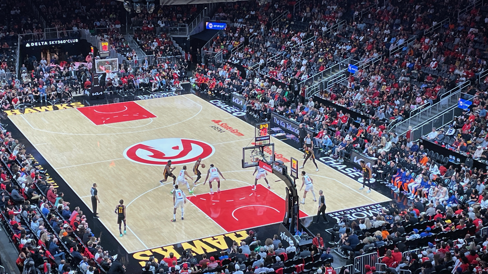

## October 30, 2023
 
Now that I am waking up earlier my exercise routine at the house is starting to form. I’ve been jump roping and/or air bike for 10 minutes per day and some squats if I want to. I’m going to progressively increase the amount of time. I noticed with jump roping I have to slowly increase the amount I do or else I will get shin splints. I’m doing squats some days as well and I am also slowly increasing the amount of weight so I don’t injure myself. When I was running I hurt myself a lot by doing too much and it always sucked to get hurt and not be able to do much exercise for a few weeks.
  

----

 
**IMPORTANT PSA**
 
My friend from college is real estate agent and he has a connection with a lender who is giving doing home loans in Georgia with the following terms: 3.99% interest, 5% minimum down payment, no PMI, credit score \>680. The big catch is that the home has to be in Georgia in an area where \>50% of the residents are minorities. Apparently there is a quota of minority-area loans that lenders have to meet and this bank the lender works for needs to meet their quota by the end of the year. I am in the process of refinancing my loan, and it hasn’t gone through yet but everything so far seems legit. I’ll update when/if it goes through. In the meantime if this is interesting to you can use [this website](https://geomap.ffiec.gov/ffiecgeomap/) to find out whether a property meets the requirements. Also you can roll the closing costs into the loan so if you wanted to buy a property that costs $300k you would pay at most 20K at closing for down payment & closing costs and you would have a mortgage of about $1800 per month. This is one of those things that seem too good to be true so I’m going about the refinancing as carefully as I can, but like I said so far it seems legit. Talk to Shaqiul (‭212-518-4452‬) if you’re interested in buying a property with this.
  

----

 
**Hawks vs Knicks**
 
Damn the Hawks played bad. They made up for it yesterday in Milwaukee, but on Friday they played so bad. But on the other hand the Knicks played amazing. It seemed like single shot they put up went in. Ilana’s Aunt and brother came with us and they got seats in the same section as us. We got Tropicalias before the game started and I woke up the next day with my head hurting quite a bit. There was a dude sitting next to us who kept saying sorry every time he got up and went by us. He said sorry 3 times every time he shuffled by us. It’s ok for real. Also there is some sort of hype squad the the Hawks pay for and for about half of the 3rd quarter 2 of them were sitting in the aisle right next to Ilana and during commercial breaks they were yelling at us to do the dances and be very loud. I was yelling and cheering anyways but when the hype squad starting yelling at me I stopped because that is quite annoying.
  

*hox*
  

----

 
Ilana was walking on the beltline today and a dog apparently followed her home. Now we are calling animal control and checking it’s chip. Apparently adopted dogs get implanted with a chip that has their owner’s address in it. If there is no chip I guess it’s our dog now and we will take it to the vet.
  

*dog*
  

----

 
I helped Joey move into a new apartment yesterday and we brought his huge couch down one flight up stairs to move it out and up 3 flights of stairs to move it in. Luckily there were 3 of us to help move it which was much better than just 2. But good lord that was a large couch and a lot of stairs. Moving is the worst thing ever. And to make it even worse I had to leave right after so I couldn’t even make Joey buy me beer or food that night. Moving sucks but it does feel good when you are done. When I see a large object I need to move I always think “there is no way we will be able to move that” but then somehow it gets done and it feels very good.