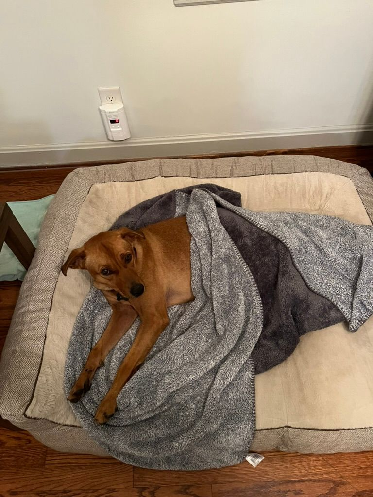
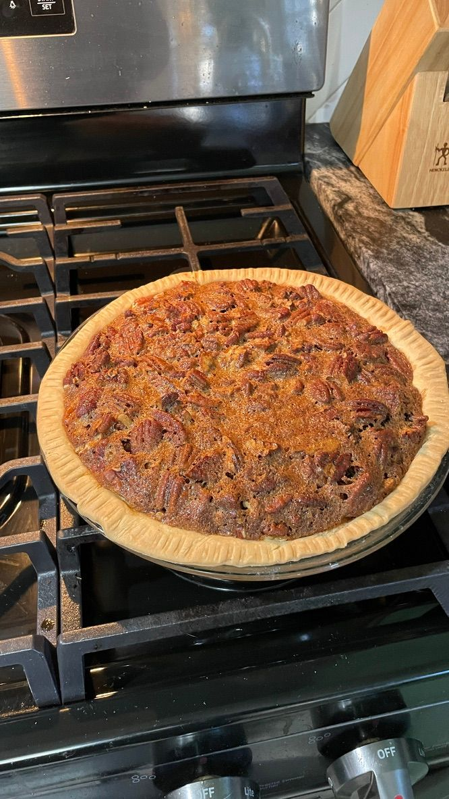

##November 20, 2023
 
Lady the dog is safe and sound at home and she is the most lucky dog in the world for following Ilana home because this stray dog now has her own dog bed and dog house and a yard to play in and we try to spend time with her all day. She is a very good dog and loves to play.
  

*won the dog lottery*
  

----

 
My company is doing layoffs. This is very good because tech companies typically give 3 months of pay when they layoff people. It would be very great if I got laid off. And if I don't get laid off that would still be great because the company has been doing very bad but the layoffs and restructuring of things should help it do better.
  

*i'll be wiping my tears with dollar billz*
  

----

 
The Hawks keep losing at home. But we beat the Wizards a few weeks ago and during the fourth quarter we walked down to the lower level and stood kinda near Dominique Wilkins because he was up there doing the TV commentary.
  

*nique next to me*
  

----

 
It's Thanksgiving time. Thanksgiving food sure is scrumptious. This year Ilana and I took it upon ourselves to join in on the cooking. We made a pecan pie and it was yummy yummy yummy.
  

*yummy yummy yummy *
  

----

 

We went to dinner at a Pub called "Twains" which apparently was named for Mark Twain because there was Mark Twain book pages on the wall. I thought that Pubs were British but I guess this was an interesting take on a Pub because it was an American version. When we got there I took a picture of the license plate of the car parked next to me because I saw the guy get out and he looked a little bit dazed and disheveled. It also had a new purchase license plate so he possibly crashed his old car and that's why he got this one.
  

*local american pub inspiration*
  

----

 
I looked up on Google "level garage floor" because I am looking into doing that so the gym in my garage is level. There was a result that said "free estimate in 2 minutes." Great. I fill out my personal info and now 1 week later I am still getting 5 calls per day from random contractors who buy people's contact information from this website. Now I have to learn all of the company names of the people who have called me and make sure I don't use any of them.
  

----

 
We went to a wedding a few weeks ago for Tommy's sister and it was a very nice time seeing Jake and Devon and Tommy. Weddings are a lot of fun. My cousin just got engaged the other day as well so that is another wedding coming up. Some more friends are getting ready to get engaged as well. Very exciting for everyone.
  

----

 
I got to see Tejas yesterday. Tejas is brilliant and driven and fun and caring and I love it when I get to see him and it's too bad he lives in Philadelphia because I don't get to see him anymore nearly as much as I would like. But we had a nice time hanging out at Suburban Tap. I've never had a bad time at Suburban Tap.