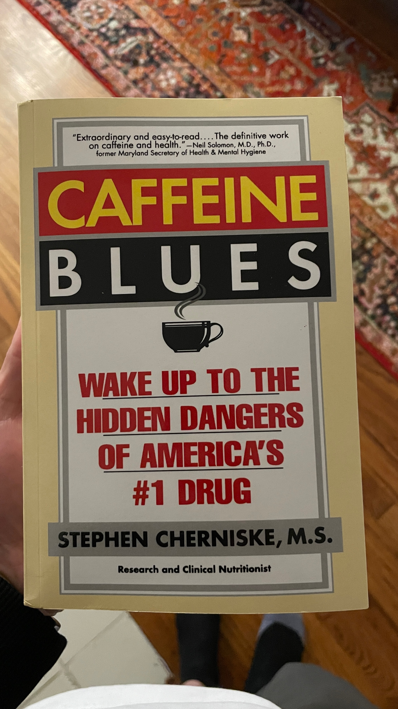
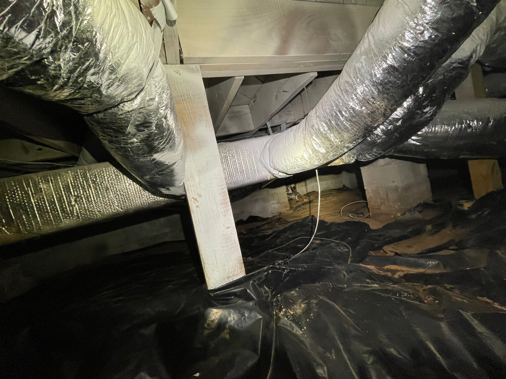
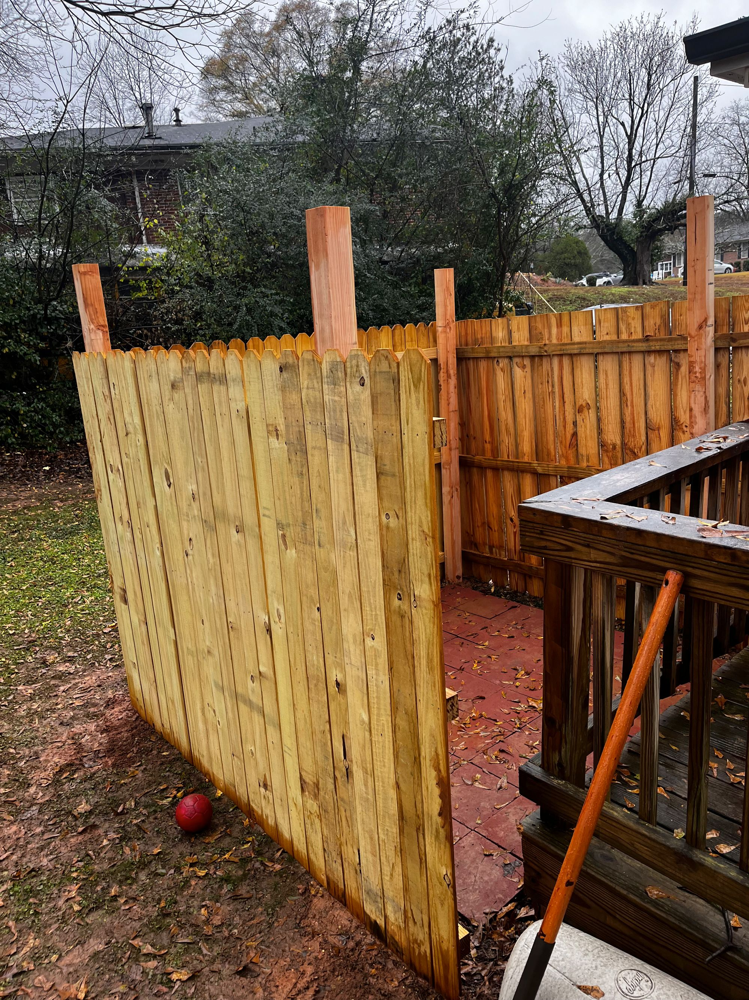

# December 11, 2023
 
Last week my team at work came to Atlanta for the week. We were very busy but had a good time hanging out. We have all been working together for over a year now and we have all seen each other in person three times now so we are all kinda buddies so we played video games and chatted a lot. We also did a lot of work in the office and when I am in the office with my team I feel a lot more engaged and care about work and feel like we all do really well. But when we are remote I care less and feel like we all do much worse work. My next job (if I have one) will be an in-office job because I need the social interaction during the day and it helps us all when the team is real and in front of each other and everyone on the team works together towards a shared goal. This is how humans have always accomplished things, working in teams towards a common goal. There is a book called _Warriors and Worriers_ which supposedly is about how men are cooperative workers and women are independent workers for various reasons. I haven’t read it yet but I will report back when I do.
  

----

 
_Caffeine Blues_ is probably the most nuts looking book I have bought in quite a bit (maybe since buying _Women and Worriers_… yes I bought it quite a while ago and it has been sitting on the shelf). Regardless, America needs to wake up to the dangers. I say with my coffee next to my laptop.
  

*Wake up America*
  

----

 
My old as hell house had a ratchet wood plank holding up basically the center of the house so I had to get that fixed. So the house people came and replaced my plank with a steel jack and added a steel beam and two more steel jacks. While they were down there they took a picture of a section of the crawl space where the opening was covered up by two air ducts. From the pictures it looked like there might be a leak back there, so I had an HVAC guy come to detach the air duct, had a plummer come and check out the area, then had the HVAC guy reattach the air ducts. There was no leak and plummer didn’t charge me much but the HVAC guy was very expensive.
  

*plank*
  

*steel*
  

----

 
Joey came over yesterday and helped me put up three fence panels next to my deck. It was cold and rainy and didn’t really know what we are doing. Joey is a fantastic friend for coming over and helping me with that because I don’t think I would have gotten that done without him and he did it with me in really bad conditions. When we were digging the holes for the posts we ran into concrete like 8 inches down which I guess was extra concrete from the house foundation. We were supposed to dig the posts in 2 feet but we could only do about 8 inches so the fence isn’t super sturdy but I think it will be fine. I will saw off the extra part of the post that is sticking up because we didn’t dig deep enough. Also if you look at the picture you can see that the farthest panel was put in upside down. That was a face palm moment. Anways I had already put brick pavers down and we put the fence up around the pavers. I have a “tent sauna” coming in the mail which is an insulated tent with a wood-burning stove and apparently gets up to like 220F. So I’m going to put that inside the fenced enclosure. Overall things with the fence ended up fine and I feel somewhat accomplished that Joey and I were able to put it up kind of successfully.
  

*fence*
  

----

 
Lady the dog is at the vet today getting spayed. In case you didn’t know “spay” is when fake doctors genital mutiliate my dog because society says we have to do that. In some African societies society says they have to genital mutilate humans as a coming-of-age ceremonial type of thing. Well I’m glad I’m not a dog and I’m glad I’m not in these African societies. The fake animal doctor is sowing up my dog’s PP right now and the karma from this cruelty is sure to revisit me someday.
  

----

 
I’ve done some research on the Atlanta Beltline this morning and it looks like, according to the plan, by Summer 2026 I should be able to bike from my house to Ponce City Market. It will be a very long bike ride but it is still very cool that will be an option. They are building lots of fancy townhouses and apartments in Bankhead and the southside where sections of the Beltline are being constructed. One thing I would like to do is replace my chain-link fence with a wooden fence and then I can have a nice locked gate in my backyard from which I can make a small path directly onto the Beltline.
  

----

 
In case you can’t tell I have been getting more interested in doing things to the house. I have a book called [Pretty Good House](https://www.amazon.com/Pretty-Good-House-Michael-Maines/dp/1641551658/ref=asc_df_1641551658/?tag=hyprod-20&linkCode=df0&hvadid=532952235284&hvpos=&hvnetw=g&hvrand=14705573747416601232&hvpone=&hvptwo=&hvqmt=&hvdev=c&hvdvcmdl=&hvlocint=&hvlocphy=9010933&hvtargid=pla-1487863986194&psc=1&mcid=6cd5fd57a8b83fd8a569956cd21d7680&gclid=CjwKCAiAg9urBhB_EiwAgw88mbgkqNy9gtslhOYwscJzvJ4SN52INtWVVhbnkjCgVQX7xybwbl7qghoCN6AQAvD_BwE) which discusses _building science_ which apparently is the science of building houses particularly in regards to energy efficiency. I also am reading [A Place of My Own](https://www.amazon.com/Place-My-Own-Architecture-Daydreams/dp/0143114743/ref=sr_1_1?crid=2SW87HFL0H7OS&keywords=A+place+of+my+own&qid=1702308722&s=books&sprefix=a+place+of+my+own%2Cstripbooks%2C75&sr=1-1) by Michael Pollan who is kind of exhausting to read but overall he is really great and I love his books. Anyways that book is him discussing how he built a little house in his backyard and it goes through the history and psychology and science of building houses. Anyways from reading these books another thing I’ve decided I would like to do is totally get rid of all of my gas appliances and replace them with electric appliances and encapsulate the crawl space after this is done. All of that would be a lot of money and I’m not sure I would ever see a return on that so that’s more of a nebulous idea than anything right now.
  

----

 
The Hawks suck :( As I correctly posited in a previous newsletter, Jalen Johnson is required for the Hawks to be anywhere close to good and he’s injured for a few more weeks.
  

*jalen johnson*

